# TABLE OF CONTENT
- [1.0. OVERVIEW](#10-overview)
- [2.0. INTRODUCTION](#20-introduction)
- [3.0. THE DATASET](#30-the-dataset)
  * [3.1.  Data source](#31--data-source)
  * [3.2. Columns Description](#32-columns-description)
- [4.0. EXPLORATORY DATA ANALYSIS (EDA)](#40-exploratory-data-analysis--eda-)
  * [4.1. Univariate Analysis](#41-univariate-analysis)
    + [4.1.1. Target variable](#411-target-variable)
    + [4.1.2. Numerical variables distribution](#412-numerical-variables-distribution)
    + [4.1.3. Categorical variable](#413-categorical-variable)
  * [4.2. Bivariate Analysis](#42-bivariate-analysis)
  * [4.3. Multivariate Analysis](#43-multivariate-analysis)
    + [4.3.1. Numerical](#431-numerical)
    + [4.3.2. Categorical](#432-categorical)
- [5.0. FULL PROJECT DEVELOPMENT](#50-full-project-development)
- [6.0. MODEL SELECTION](#60-model-selection)
  * [6.1. Hyper parameter Fine Tuning](#61-hyper-parameter-fine-tuning)
  * [6.2. Final model Performance](#62-final-model-performance)
  * [Observing the results](#observing-the-results)
      - [1. Prediction x Target Variable](#1-prediction-x-target-variable)
      - [2. Error Rate](#2-error-rate)
      - [3. Error Distribution](#3-error-distribution)
      - [4. Predictions x Error](#4-predictions-x-error)
- [7.0. EXPLAINING RESULTS](#70-explaining-results)
- [8.0. EXTRA IMPLEMENTATION SUGGESTIONS](#80-extra-implementation-suggestions)

# 1.0. OVERVIEW

* Brief introduction about corona virus
* Explain about dataset
* Demonstrate model results

# 2.0. INTRODUCTION

Corona virus disease 2019 (COVID-19) is an infectious disease caused by a newly discovered corona virus. The median incubation period of SARS-CoV-2 is 5 days (ranging from 2 to 14 days), and people who develop symptoms do so within 12 days of infection (ranging from 8 to 16 days). A sizable portion of person-to-person virus transmission may occur before infected individuals develop symptoms. A fraction of infected individuals never develop symptoms (asymptomatics) yet may contribute substantially to disease transmission. Nucleic acid tests (NATs) can diagnose SARS-CoV-2 infection and are typically used after the onset of symptoms. The recovery period for mild cases of COVID-19 is 2 weeks and that for severe cases is 6 weeks. In the most severe cases, the time from symptom onset to death ranges between 2 and 8 weeks.

The current outbreak of corona virus SARS‐CoV‐2, epi‐centred in Hubei Province of the People’s Republic of China, has spread to many other countries. On 30. January 2020, the WHO Emergency Committee declared a global health emergency based on growing case notification rates at Chinese and international locations. The case detection rate is changing daily and can be tracked in almost real time on the website provided by Johns Hopkins University and other forums. As of midst of February 2020, China bears the large burden of morbidity and mortality, whereas the incidence in other Asian countries, in Europe and North America remains low so far.

# 3.0. THE DATASET

 The data contain 81437 (0 to 81436) entries and 59 columns (54 floats and 5 objects ).

## 3.1.  Data source

Our *dataset* is provided by https://ourworldindata.org/covid-cases, if you want help them to bring data and research, donate https://ourworldindata.org/donate.

## 3.2. Columns Description

| column                                | source                                                       | description                                                  |
| ------------------------------------- | ------------------------------------------------------------ | ------------------------------------------------------------ |
| iso_code                              | International Organization for Standardization               | ISO 3166-1 alpha-3 – three-letter country codes              |
| continent                             | Our World in Data                                            | Continent of the geographical location                       |
| location                              | Our World in Data                                            | Geographical location                                        |
| date                                  | Our World in Data                                            | Date of observation                                          |
| total_cases                           | COVID-19 Data Repository by the Center for Systems Science and Engineering (CSSE) at Johns Hopkins University | Total confirmed cases of COVID-19                            |
| new_cases                             | COVID-19 Data Repository by the Center for Systems Science and Engineering (CSSE) at Johns Hopkins University | New confirmed cases of COVID-19                              |
| new_cases_smoothed                    | COVID-19 Data Repository by the Center for Systems Science and Engineering (CSSE) at Johns Hopkins University | New confirmed cases of COVID-19 (7-day smoothed)             |
| total_deaths                          | COVID-19 Data Repository by the Center for Systems Science and Engineering (CSSE) at Johns Hopkins University | Total deaths attributed to COVID-19                          |
| new_deaths                            | COVID-19 Data Repository by the Center for Systems Science and Engineering (CSSE) at Johns Hopkins University | New deaths attributed to COVID-19                            |
| new_deaths_smoothed                   | COVID-19 Data Repository by the Center for Systems Science and Engineering (CSSE) at Johns Hopkins University | New deaths attributed to COVID-19 (7-day smoothed)           |
| total_cases_per_million               | COVID-19 Data Repository by the Center for Systems Science and Engineering (CSSE) at Johns Hopkins University | Total confirmed cases of COVID-19 per 1,000,000 people       |
| new_cases_per_million                 | COVID-19 Data Repository by the Center for Systems Science and Engineering (CSSE) at Johns Hopkins University | New confirmed cases of COVID-19 per 1,000,000 people         |
| new_cases_smoothed_per_million        | COVID-19 Data Repository by the Center for Systems Science and Engineering (CSSE) at Johns Hopkins University | New confirmed cases of COVID-19 (7-day smoothed) per 1,000,000 people |
| total_deaths_per_million              | COVID-19 Data Repository by the Center for Systems Science and Engineering (CSSE) at Johns Hopkins University | Total deaths attributed to COVID-19 per 1,000,000 people     |
| new_deaths_per_million                | COVID-19 Data Repository by the Center for Systems Science and Engineering (CSSE) at Johns Hopkins University | New deaths attributed to COVID-19 per 1,000,000 people       |
| new_deaths_smoothed_per_million       | COVID-19 Data Repository by the Center for Systems Science and Engineering (CSSE) at Johns Hopkins University | New deaths attributed to COVID-19 (7-day smoothed) per 1,000,000 people |
| reproduction_rate                     | Arroyo Marioli et al. (2020). https://doi.org/10.2139/ssrn.3581633 | Real-time estimate of the effective reproduction rate (R) of COVID-19. See https://github.com/crondonm/TrackingR/tree/main/Estimates-Database |
| icu_patients                          | European CDC for European countries / UK Government / HHS for the United States / COVID-19 Tracker for Canada | Number of COVID-19 patients in intensive care units (ICUs) on a given day |
| icu_patients_per_million              | European CDC for European countries / UK Government / HHS for the United States / COVID-19 Tracker for Canada | Number of COVID-19 patients in intensive care units (ICUs) on a given day per 1,000,000 people |
| hosp_patients                         | European CDC for European countries / UK Government / HHS for the United States / COVID-19 Tracker for Canada | Number of COVID-19 patients in hospital on a given day       |
| hosp_patients_per_million             | European CDC for European countries / UK Government / HHS for the United States / COVID-19 Tracker for Canada | Number of COVID-19 patients in hospital on a given day per 1,000,000 people |
| weekly_icu_admissions                 | European CDC for European countries / UK Government          | Number of COVID-19 patients newly admitted to intensive care units (ICUs) in a given week |
| weekly_icu_admissions_per_million     | European CDC for European countries / UK Government          | Number of COVID-19 patients newly admitted to intensive care units (ICUs) in a given week per 1,000,000 people |
| weekly_hosp_admissions                | European CDC for European countries / UK Government / HHS for the United States | Number of COVID-19 patients newly admitted to hospitals in a given week |
| weekly_hosp_admissions_per_million    | European CDC for European countries / UK Government / HHS for the United States | Number of COVID-19 patients newly admitted to hospitals in a given week per 1,000,000 people |
| total_tests                           | National government reports                                  | Total tests for COVID-19                                     |
| new_tests                             | National government reports                                  | New tests for COVID-19 (only calculated for consecutive days) |
| total_tests_per_thousand              | National government reports                                  | Total tests for COVID-19 per 1,000 people                    |
| new_tests_per_thousand                | National government reports                                  | New tests for COVID-19 per 1,000 people                      |
| new_tests_smoothed                    | National government reports                                  | New tests for COVID-19 (7-day smoothed). For countries that don't report testing data on a daily basis, we assume that testing changed equally on a daily basis over any periods in which no data was reported. This produces a complete series of daily figures, which is then averaged over a rolling 7-day window |
| new_tests_smoothed_per_thousand       | National government reports                                  | New tests for COVID-19 (7-day smoothed) per 1,000 people     |
| positive_rate                         | National government reports                                  | The share of COVID-19 tests that are positive, given as a rolling 7-day average (this is the inverse of tests_per_case) |
| tests_per_case                        | National government reports                                  | Tests conducted per new confirmed case of COVID-19, given as a rolling 7-day average (this is the inverse of positive_rate) |
| tests_units                           | National government reports                                  | Units used by the location to report its testing data        |
| total_vaccinations                    | National government reports                                  | Total number of COVID-19 vaccination doses administered      |
| people_vaccinated                     | National government reports                                  | Total number of people who received at least one vaccine dose |
| people_fully_vaccinated               | National government reports                                  | Total number of people who received all doses prescribed by the vaccination protocol |
| new_vaccinations                      | National government reports                                  | New COVID-19 vaccination doses administered (only calculated for consecutive days) |
| new_vaccinations_smoothed             | National government reports                                  | New COVID-19 vaccination doses administered (7-day smoothed). For countries that don't report vaccination data on a daily basis, we assume that vaccination changed equally on a daily basis over any periods in which no data was reported. This produces a complete series of daily figures, which is then averaged over a rolling 7-day window |
| total_vaccinations_per_hundred        | National government reports                                  | Total number of COVID-19 vaccination doses administered per 100 people in the total population |
| people_vaccinated_per_hundred         | National government reports                                  | Total number of people who received at least one vaccine dose per 100 people in the total population |
| people_fully_vaccinated_per_hundred   | National government reports                                  | Total number of people who received all doses prescribed by the vaccination protocol per 100 people in the total population |
| new_vaccinations_smoothed_per_million | National government reports                                  | New COVID-19 vaccination doses administered (7-day smoothed) per 1,000,000 people in the total population |
| stringency_index                      | Oxford COVID-19 Government Response Tracker, Blavatnik School of Government | Government Response Stringency Index: composite measure based on 9 response indicators including school closures, workplace closures, and travel bans, rescaled to a value from 0 to 100 (100 = strictest response) |
| population                            | United Nations, Department of Economic and Social Affairs, Population Division, World Population Prospects 2019 Revision | Population in 2020                                           |
| population_density                    | World Bank World Development Indicators, sourced from Food and Agriculture Organization and World Bank estimates | Number of people divided by land area, measured in square kilometers, most recent year available |
| median_age                            | UN Population Division, World Population Prospects, 2017 Revision | Median age of the population, UN projection for 2020         |
| aged_65_older                         | World Bank World Development Indicators based on age/sex distributions of United Nations World Population Prospects 2017 Revision | Share of the population that is 65 years and older, most recent year available |
| aged_70_older                         | United Nations, Department of Economic and Social Affairs, Population Division (2017), World Population Prospects 2017 Revision | Share of the population that is 70 years and older in 2015   |
| gdp_per_capita                        | World Bank World Development Indicators, source from World Bank, International Comparison Program database | Gross domestic product at purchasing power parity (constant 2011 international dollars), most recent year available |
| extreme_poverty                       | World Bank World Development Indicators, sourced from World Bank Development Research Group | Share of the population living in extreme poverty, most recent year available since 2010 |
| cardiovasc_death_rate                 | Global Burden of Disease Collaborative Network, Global Burden of Disease Study 2017 Results | Death rate from cardiovascular disease in 2017 (annual number of deaths per 100,000 people) |
| diabetes_prevalence                   | World Bank World Development Indicators, sourced from International Diabetes Federation, Diabetes Atlas | Diabetes prevalence (% of population aged 20 to 79) in 2017  |
| female_smokers                        | World Bank World Development Indicators, sourced from World Health Organization, Global Health Observatory Data Repository | Share of women who smoke, most recent year available         |
| male_smokers                          | World Bank World Development Indicators, sourced from World Health Organization, Global Health Observatory Data Repository | Share of men who smoke, most recent year available           |
| handwashing_facilities                | United Nations Statistics Division                           | Share of the population with basic handwashing facilities on premises, most recent year available |
| hospital_beds_per_thousand            | OECD, Eurostat, World Bank, national government records and other sources | Hospital beds per 1,000 people, most recent year available since 2010 |
| life_expectancy                       | James C. Riley, Clio Infra, United Nations Population Division | Life expectancy at birth in 2019                             |
| human_development_index               | United Nations Development Programme (UNDP)                  | A composite index measuring average achievement in three basic dimensions of human development—a long and healthy life, knowledge and a decent standard of living. Values for 2019, imported from http://hdr.undp.org/en/indicators/137506 |

# 4.0. EXPLORATORY DATA ANALYSIS (EDA)

Performing initial investigations on data to discover patterns, spot anomalies and test hypothesis.

## 4.1. Univariate Analysis

The purpose is to describe. summarizes and find patterns in data. It doesn't deal with causes or relationships.

### 4.1.1. Target variable

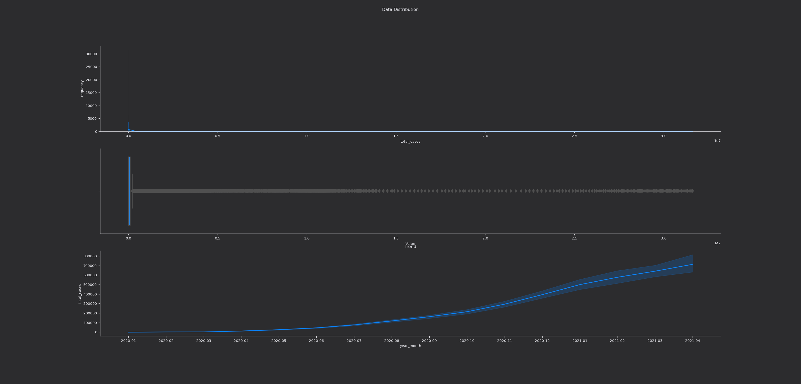

It has a right long tail, which evidences an outliers presence with zero values influence.

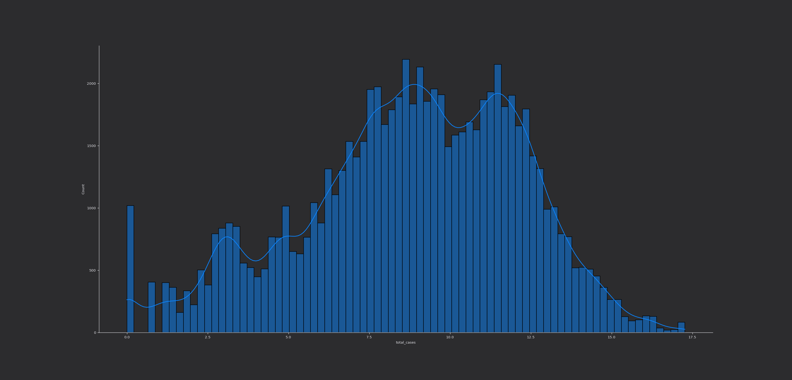

### 4.1.2. Numerical variables distribution

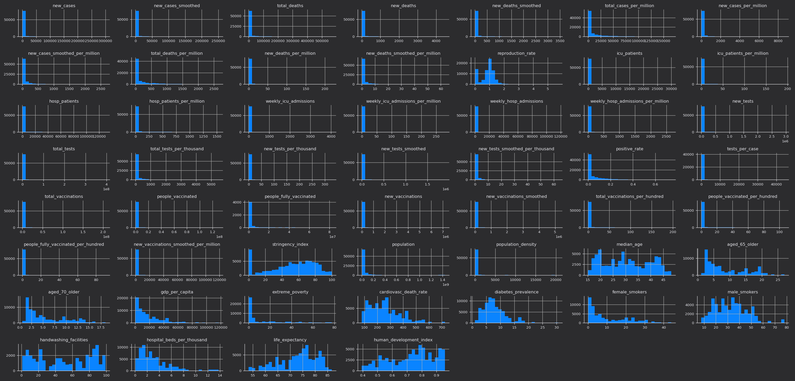

* Some of the balances have negative values.
* Theres 36 features with high value range, which make it not readable in distributions plot.
* There's 41 balances with high outliers influence.
* In most variable there is a strong presence of 0 values.

### 4.1.3. Categorical variable


## 4.2. Bivariate Analysis

Bivariate analysis highlights:

### H1. Brazil more likely to Covid19 than USA in total cases. (TRUE)

Brazil has a smaller population and has more cases than USA.

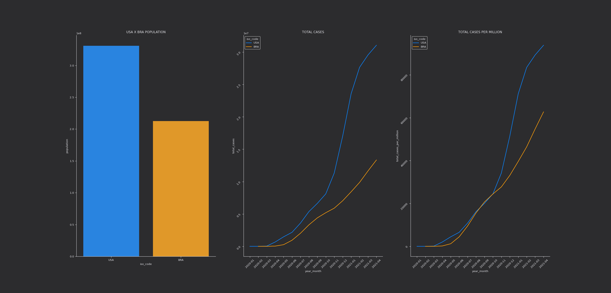

### H2. Continent's with high vaccination rate are more effective on Covid19 control. (PERHAPS)

There are still not enough elements since the vaccine is a recent event, but the continents with the highest numbers of cases are vaccinating more. A strong correlation between total cases and total vaccine.

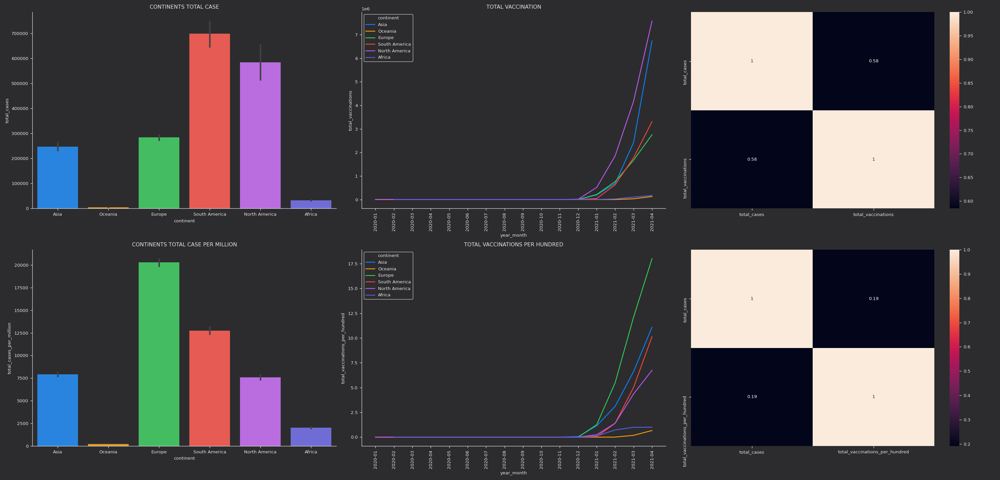

### H3. Countries with high populatation density are more likely to Covid19. (FALSE)

There is a weak correlation between the total number of cases and population density. In top 5 countries with higher cases, only Indian has high population density.

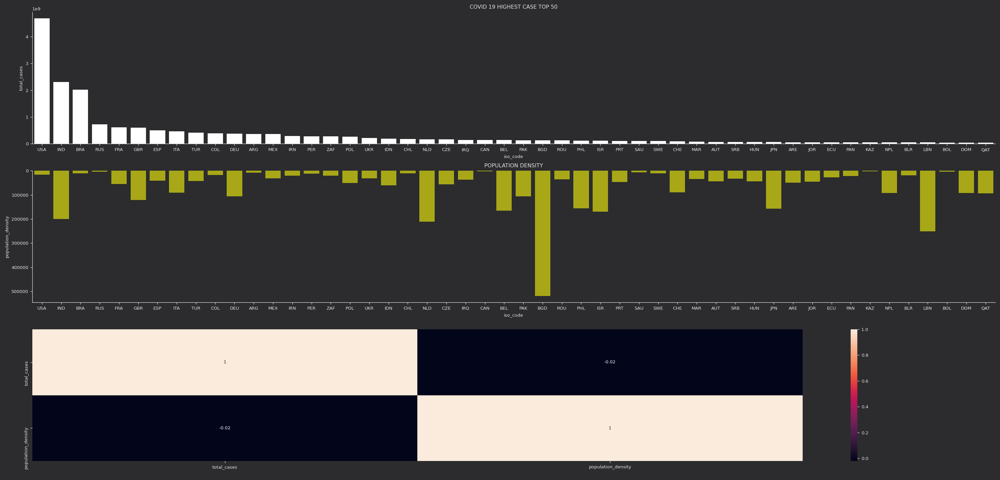

### H8. Brazil is more likely to new cases of Covid19. (FALSE)

Brazil is the third in number of total cases.

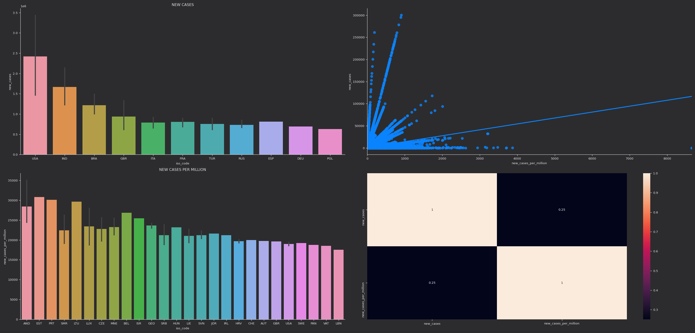

### H10. Brazil is more likely Covid19 in South America. (TRUE)

In south america Brazil has the highest number of cases.

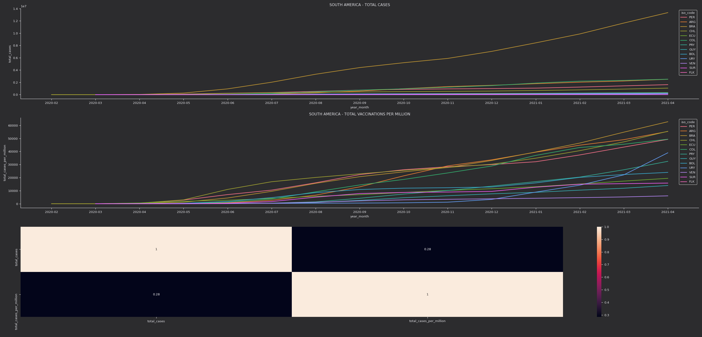

#### Hypothesis summary

| INDEX | HYPOTHESIS                                                   | RESULT  |
| ----- | ------------------------------------------------------------ | ------- |
| H1    | Brazil more likely to Covid19 than USA in total cases.       | TRUE    |
| H2    | Continent's with high vaccination rate are more effective on Covid19 control. | PERHAPS |
| H3    | Countries with high populatation density are more likely to Covid19. | FALSE   |
| H4    | Countries with high elderly are most affected by Covid19.    | FALSE   |
| H5    | Countries with high GDP are less likely to covid19.          | FALSE   |
| H6    | USA has more Covid19 death.                                  | TRUE    |
| H7    | European continent conducted the highest number of tests.    | TRUE    |
| H8    | Brazil is more likely to new cases of Covid19.               | FALSE   |
| H9    | USA is more likely to vaccination.                           | PERHAPS |
| H10   | Brazil is more likely Covid19 in South America.              | TRUE    |

## 4.3. Multivariate Analysis

Multivariate analysis of numerical attributes made with pearson's correlation method.

### 4.3.1. Numerical

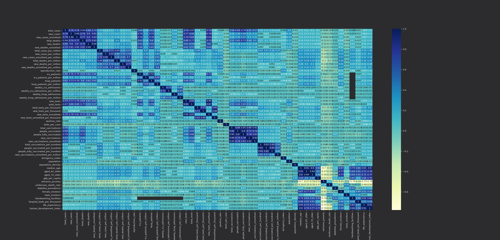

### 4.3.2. Categorical

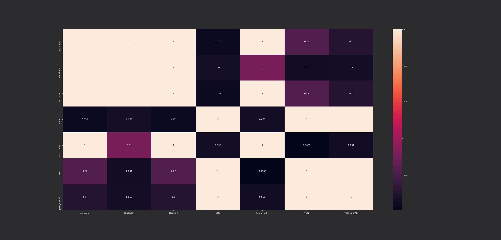

# 5.0. FULL PROJECT DEVELOPMENT

The full code can be found in the link to my repository below!

<LINKGITHUB>

# 6.0. MODEL SELECTION

The following models were training to solve a total cases task:

* Linear Regression
* K-Neighbors Regression
* Random Forest Regression
* XGBoost Regression

All the models were evaluated with cross-validation through sklearn's. **XGBoost Regression** is the best model with MAE, MSE and RSME metrics and it took less time to run.

|                    Model |              MAE |           R2 |             RMSE |
| -----------------------: | ---------------: | -----------: | ---------------: |
| Random Forest Regression |      3715.799479 |     0.999285 |     34987.032940 |
|    **XGBoost Regressor** | **16099.136087** | **0.998927** | **42860.726909** |
|     KNeighbors Regressor |    135188.559373 |     0.687200 |    731966.489764 |
|        Linear Regression |    175669.154157 |     0.847690 |    510765.653277 |

## 6.1. Hyper parameter Fine Tuning

The goal here is to find best set of parameters that maximizes the algorithm learning. We apply GridSearchCV method.


```
XGBRegressor(base_score=0.5, booster='gbtree', colsample_bylevel=1,
             colsample_bynode=1, colsample_bytree=0.5, eta=0.06, gamma=0,
             gpu_id=-1, importance_type='gain', interaction_constraints='',
             learning_rate=0.0599999987, max_delta_step=0, max_depth=7,
             min_child_weight=1, missing=nan, monotone_constraints='()',
             n_estimators=100, n_jobs=8, num_parallel_tree=1, random_state=0,
             reg_alpha=0, reg_lambda=1, scale_pos_weight=1, subsample=0.8,
             tree_method='exact', validate_parameters=1, verbosity=None)
```

|   Model Name |        MAE |   MAE STD |       R2 |       RSME |   RSME STD |
| -----------: | ---------: | --------: | -------: | ---------: | ---------: |
| XGBoost + CV | 10175.5649 | 1125.5848 | 0.996989 | 73732.5752 | 30980.5109 |
|   XGBoost CV | 17975.5480 |  580.7987 | 0.997268 | 72664.5686 | 14986.2523 |


## 6.2. Final model Performance

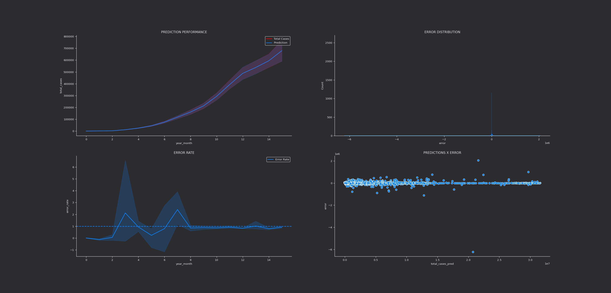

## Observing the results

#### 1. Prediction x Target Variable

The first graphic shows the prediction and total cases, we can see the prediction is pretty close. The shadows represents a variance of several predictions.

#### 2. Error Rate

Ratio between prediction values and observed ones is present by this chart. The error rate has some variance.

#### 3. Error Distribution

It is important to analyze the residuals behavior when dealing with regression. One of the most important premises of a good model is the residuals to have a gaussian distribution (normal-shaped) with zero mean and constant variance. As shown bellow, it's not a perfect fit, but it's good enough to continue in this cycle.

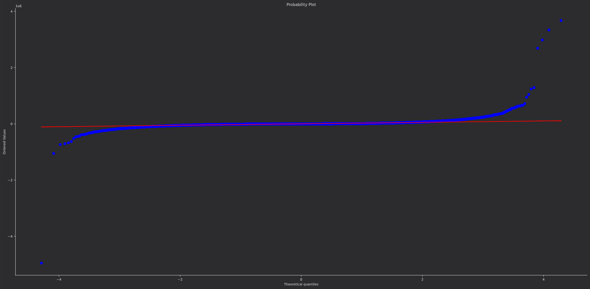

#### 4. Predictions x Error

The scatter plot shows the predictions values by each error value. The ideal shape of a good predictions is the point's distribution inside a "tube", which means that error variance along the prediction range is continuous.


# 7.0. EXPLAINING RESULTS

Using a XGBoost Regression to build a model to predict Covid19 total cases, it was possible to achieve:

* MAE - The mean absolute error calculates the absolute difference between each target value and predict value, then sums all of them and divide by the number of observations. It's robust in outliers presence and easy understand.

  * Hyper parameter increase MAE's performance in 56%.

* R Squared (R²) - Coefficient of determination, regression score function. 

  * It's pretty similar.

* RSME - root-mean-square error is a frequently used measure of the differences between values (sample or population values) predicted by a model or an estimator and the values observed.

  * Hyper parameter decreased RSME in 2%.

  

# 8.0. EXTRA IMPLEMENTATION SUGGESTIONS

In order to get a better accuracy, there are some points that I'd like to suggest:

* Inspect and treat, if necessary, outliers;
* Inspect and treat the negative values;
* Add new features;
* Train another model without normalized data;
* Experiment other machine learning algorithms to improve performance;
* Experiment another hyper-parameter fine-tuning;
* Deploy the results with streamlit;
